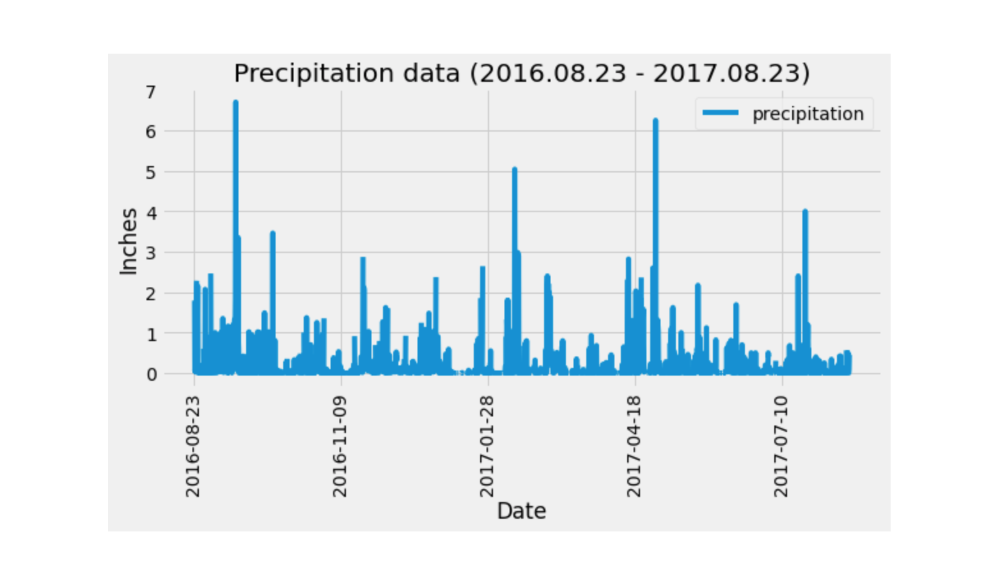
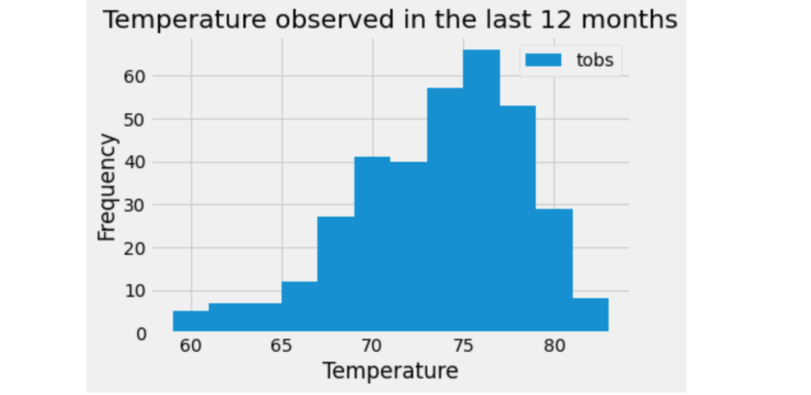
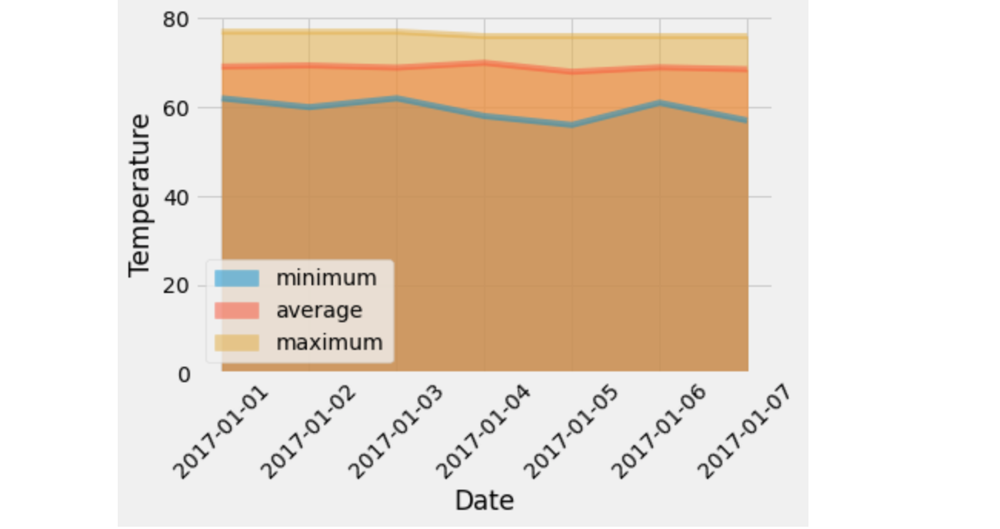

# SQLAlchemy Challenge - Surfs Up!

## Introduction
Perform a basic climate analysis & data exploration on Honolulu, Hawaii using Python and SQLAlchemy.

## Data
* [Climate Database](hawaii.sqlite)

## Analysis
### Climate Analysis and Exploration
* Reflect Tables into SQLAlchemy ORM

### Precipitation Analysis
* Retrieve the precipitation data between 2016.08.23 - 2017.08.23 and select only the `date` and `prcp` values
* Load the query results into a Pandas DataFrame and set the index to the `date` column then sort the DataFrame values by `date`
* Plot the results using the DataFrame `plot` method

  

### Station Analysis
* Calculate the total number of stations
* Find the most active stations, and
  * List the stations and observation counts in descending order
  * Identify the station that has the highest number of observations

* Retrieve the last 12 months of temperature observation data (TOBS)
  * Filter by the station with the highest number of observations and plot the results as a histogram
  
    

### Temperature Analysis
* Performed unpaired t-test between average temperature in June and December in Hawaii. The result showed no significant differences between the two months, therefore we can't not reject the null hypothesis
* Calculate and plot the min, avg, and max temperatures between 2017-01-01 - 2017-01-07 as a bar chart 

### Daily Rainfall Average
* Calculate the rainfall per weather station using the previous year's matching dates
* Calculate the daily normals. Normals are the averages for the min, avg, and max temperatures
* Create a list of dates for your trip in the format `%m-%d`. Use the `daily_normals` function  to calculate the normals for each date string and append the results to a list
* Load the list of daily normals into a Pandas DataFrame and set the index equal to the date
* Use Pandas to plot an area plot (`stacked=False`) for the daily normals

  

## Climate App
Design a Flask API based on the queries above.
* Use Flask to create your routes.
### Routes
* `/`
  * Home page and list all available routes
* `/api/v1.0/precipitation`
  * Convert the query results to a dictionary using `date` as the key and `prcp` as the value
  * Return the JSON representation
* `/api/v1.0/stations`
  * Return a JSON list of stations from the dataset
* `/api/v1.0/tobs`
  * Query the dates and temperature observations of the most active station for the last year of data
  * Return a JSON list of temperature observations (TOBS) for the previous year
* `/api/v1.0/<start>` and `/api/v1.0/<start>/<end>`
  * Return a JSON list of the minimum temperature, the average temperature, and the max temperature for a given start or start-end range
  * When given the start only, calculate `TMIN`, `TAVG`, and `TMAX` for all dates greater than and equal to the start date
  * When given the start and the end date, calculate the `TMIN`, `TAVG`, and `TMAX` for dates between the start and end date inclusive
  

## Tools
* SQLAlchemy
* PostgreSQL
* Python
* Pandas
* Matplotlib

## Copyright

Trilogy Education Services © 2019. All Rights Reserved.

